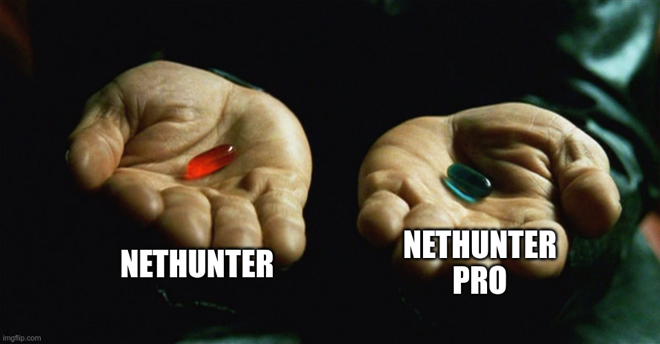
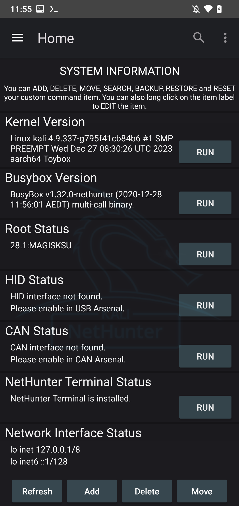

<style>

/* @theme rose-pine-moon */
/*
Rosé Pine theme create by RAINBOWFLESH
> www.rosepinetheme.com
MIT License https://github.com/rainbowflesh/Rose-Pine-For-Marp/blob/master/license

palette in :root
*/

@import "default";
@import "schema";
@import "structure";

:root {
    --base: #232136;
    --surface: #2a273f;
    --overlay: #393552;
    --muted: #6e6a86;
    --subtle: #908caa;
    --text: #e0def4;
    --love: #eb6f92;
    --gold: #f6c177;
    --rose: #ea9a97;
    --pine: #3e8fb0;
    --foam: #9ccfd8;
    --iris: #c4a7e7;
    --highlight-low: #2a283e;
    --highlight-muted: #44415a;
    --highlight-high: #56526e;

    font-family: Pier Sans, ui-sans-serif, system-ui, -apple-system,
        BlinkMacSystemFont, Segoe UI, Roboto, Helvetica Neue, Arial, Noto Sans,
        sans-serif, "Apple Color Emoji", "Segoe UI Emoji", Segoe UI Symbol,
        "Noto Color Emoji";
    font-weight: initial;

    background-color: var(--base);
}
/* Common style */
h1 {
    color: var(--rose);
    padding-bottom: 2mm;
    margin-bottom: 12mm;
}
h2 {
    color: var(--rose);
}
h3 {
    color: var(--rose);
}
h4 {
    color: var(--rose);
}
h5 {
    color: var(--rose);
}
h6 {
    color: var(--rose);
}
a {
    color: var(--iris);
}
p {
    font-size: 20pt;
    font-weight: 600;
    color: var(--text);
}
code {
    color: var(--text);
    background-color: var(--highlight-muted);
}
text {
    color: var(--text);
}
ul {
    color: var(--subtle);
}
li {
    color: var(--subtle);
}
img {
    background-color: var(--highlight-low);
}
strong {
    color: var(--text);
    font-weight: inherit;
    font-weight: 800;
}
mjx-container {
    color: var(--text);
}
marp-pre {
    background-color: var(--overlay);
    border-color: var(--highlight-high);
}

/* Code blok */
.hljs-comment {
    color: var(--muted);
}
.hljs-attr {
    color: var(--foam);
}
.hljs-punctuation {
    color: var(--subtle);
}
.hljs-string {
    color: var(--gold);
}
.hljs-title {
    color: var(--foam);
}
.hljs-keyword {
    color: var(--pine);
}
.hljs-variable {
    color: var(--text);
}
.hljs-literal {
    color: var(--rose);
}
.hljs-type {
    color: var(--love);
}
.hljs-number {
    color: var(--gold);
}
.hljs-built_in {
    color: var(--love);
}
.hljs-params {
    color: var(--iris);
}
.hljs-symbol {
    color: var(--foam);
}
.hljs-meta {
    color: var(--subtle);
}

</style>
# Kali Nethunter

Brayden Houston
<!-- paginate: skip -->

---
<!-- paginate: true -->

```zsh
$ whoami
Name: Brayden
Interests: homelab, automation, devops, running
Shameless Plugs: DC608, Wisconsin CRT
$ 
```


<!-- 
Come check out the ISP Ward
Check out DC608. Stick around for Will's talk right after mine.
Come find me after if you are interested in CRT
-->


---
## Quick Reminder From Safety Dwight
<!-- paginate: true -->


<!-- 
This is a tool. Use it for good and don't do stuff you aren't allow to to systems that aren't yours.
-->

---

## What is Kali Nethunter?
<!-- paginate: true -->


<!-- 
I think most of us are familiar with Kali

Its a great distro full of plenty of hacking tools ready to use

Nethunter takes those tools and its basically.....
-->

---
<!-- paginate: true -->
Its Kali but on your phone


<!-- 
Its like Kali was ripped from its desktop setting and dropped onto a mobile platform. 

Infinity War spoilers 🤭
-->


---
## Why Nethunter?
<!-- paginate: true -->
- Turn you phone into a sick cyberdeck(phone?)
- Plug in usb devices for more options
- Phones are everywhere and who would expect a phone to be a security risk-it looks nothing like a Raspberry Pi or Flipper Zero 🐬

<!-- 
Older flagships still have a ton of power for a portable device. 
Built in wifi and BLE mean we don't need extra adapters or dongles to start scanning. 
Although most devices let you add those via usb too once rooted

A perfect pairing with small hacking devices like Alex talked about in his talk yesterday!
-->

---

## What can we do?

- Bad USB
- Wigle/Kismet Wardriving
- BT Attacks
- Wifi Scans, Deauth
- CAN Arsenal
- Way more

<!-- 
If you like a tool in Kali you probably have it here. If not install it or port it to have everything you want in your pocket.
-->


---
<!-- paginate: true -->
### What do we need to get started?

- One or more supported tablet, phone, or watch (Sorry iOS 🥲)
- A few minutes or maybe an afternoon
- Decide which edition you want to try

<!-- 
Depending on what edition of nethunter you want to setup you might need some time to flash you device and run through some setup.

 Sorry this doesn't work on Apple devices
-->

---
<!-- paginate: true -->
## Editions

| Edition            | Usage                                                                 |
| ------------------ | --------------------------------------------------------------------- |
| NetHunter Lite     | The full NetHunter package for rooted phones without a custom kernel. |
| NetHunter          | The full NetHunter package with custom kernel for supported devices   |


---
<!-- paginate: true -->

| Feature            | NetHunter Lite | NetHunter |
| ------------------ | -------------- | --------- |
| App Store          | Yes            | Yes       |
| Kali cli           | Yes            | Yes       |
| All Kali packages  | Yes            | Yes       |
| KeX                | Yes            | Yes       |
| Metasploit w/o DB  | Yes            | Yes       |
| Metasploit with DB | Yes            | Yes       |
| NetHunter App      | Yes            | Yes       |
| Requires TWRP      | Yes            | Yes       |
| Requires Root      | Yes            | Yes       |

---

## Couple Differences
<!-- paginate: true -->

| Feature        | NetHunter Lite | NetHunter |
| -------------- | -------------- | --------- |
| WiFi Injection | No             | Yes       |
| HID attacks    | No             | Yes       |
| BT Arsenal     | No             | Yes       |
| CAN Arsenal    | No             | Yes       |


<!-- 
Some stuff takes kernel level access to do.
-->

---

<!-- paginate: true -->
Full and Lite versions probably aren't daily driver phone material


<!-- 
Understand the risks if you are going to rock a rooted phone as your daily. 

Rooting does give you access to lots of fun system resources but carries risk.

As something in your tool bag though.

-->


---
## Install Nethunter
<!-- paginate: true -->

https://www.kali.org/get-kali/#kali-mobile

<!-- 

In the interest of time I am not going over how to flash and root your device. Head to kali and follow their docs. Youtube is also full of guides if you need more detailed instructions.

-->

---
## Phone Options
<!-- paginate: true -->
Nethunter "Pro"
	- Pinephone and PinePhonePro
	- Some Android Phones

Nethunter
	- Most Android Phones



<!-- 
Depending on what device you choose to run Nethunter on your experience might be a little different.

Nethunter Pro runs a full standalone Linux Environment

Regular runs in alongside Android in a chroot. If you are rooted you have full access to both systems. 

Model specific and generic images available
-->


---


## I tried them both
<!-- paginate: true -->

<!-- 

I need to add some screenshots here of both phone's NH app 

Might show couple to show the phones in action once I see how much time this section has.

-->


---


## Android Impressions
<!-- paginate: true -->
Still rocking a OnePlus6 as my Nethunter device

One of the "Pro" compatible devices

Having root access lets us do fun things like re-purposing the alert slider

Still use Android apps. Sideload Gapps if you need them




---
## PinePhone Impressions
<!-- paginate: true -->
Kinda like having a Raspberry Pi in your pocket-for better or worse.

The functionality is all there but the Posh Mobile interface isn't my favorite

The beta/developer hardware probably isn't doing the vision for the experience justice

Shout outs to the Pine64 IRC/Discord!

If you run Posh, switch off the default keyboard and thank me later

```sh
sudo apt install squeekboard
sudo apt remove phosh-osk-stub
sudo init 6
```

<!--

I figured I had to try the "Pro" 

- Time allowing so background about getting and troubleshooting the phone. Long story short, committed to the idea the end of January and panic bought it near the beginning of January

- 

- Still a beta product-not meant to be a flagship killer.

- Full access to the hardware without fighting vendor security is really nice
- 
- I wanted to try it thinking life outside Android would be better, in my testing I think I would stick with NH on Android for now.....
- There are some stronger Linux phones on the horizon
-->

---
## Is Rootless An Option?
<!-- paginate: true -->

---

## Yes
<!-- paginate: true -->

| NetHunter Rootless | The core of NetHunter for unrooted, unmodified devices                |
| ------------------ | --------------------------------------------------------------------- |

| Feature            | NetHunter Rootless |
| ------------------ | ------------------ |
| App Store          | Yes                |
| Kali cli           | Yes                |
| All Kali packages  | Yes                |
| KeX                | Yes                |
| Metasploit w/o DB  | Yes                |

<!-- 
Low commitment and easy way to try out Kali Nethunter today. Just missing some of the bells and whistles we mentioned before.

If you are willing to take some trade offs its still a useful tool to keep in your....back pocket
-->

---

## Demo

---
## One more thing
<!-- paginate: true -->

---

## New Android Terminal

- Currently Pixel only
- A full Debian VM
- Still some (Android) system and hardware restrictions
- Still under development by Google
- Currently a 16gb max file system
- Yes it runs Doom

<!--
Not Kali but this just dropped a couple weeks ago so I had to try it out. Since we have been looking at running extra systems on our phones....
-->


---


## Q & A
<!-- paginate: true -->

---


## Slides
<!-- paginate: true -->
If you want to see the devices hands on come to the ISP Village. 

Reach out and show me what you do with Nethunter!

I'll push the slides here after the talk:
https://github.com/braydenhouston/CC-KaliNethunter


---

## Helpful Resources
<!-- paginate: true -->
https://forums.kali.org/
Pine64 - Discord and IRC channels
@davidbombale
https://justhack.in/connect-to-kali-nethunter-vnc-server-from-local-network