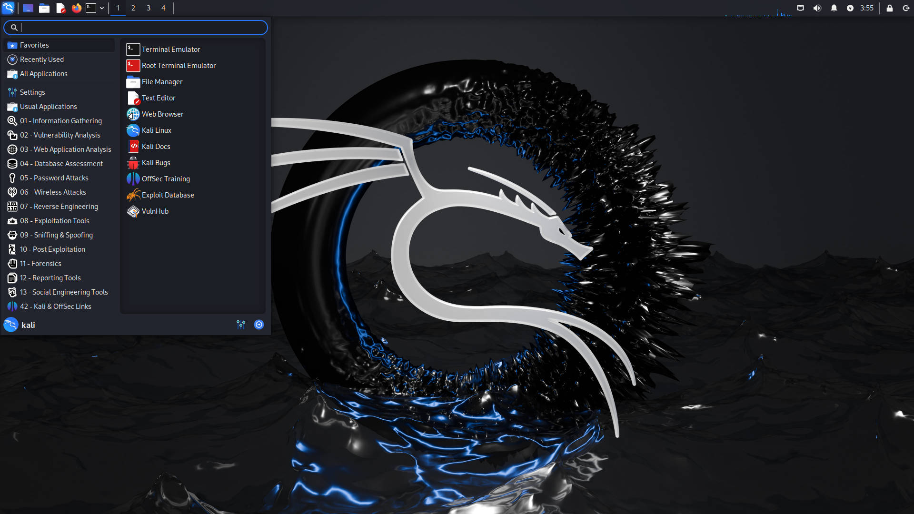
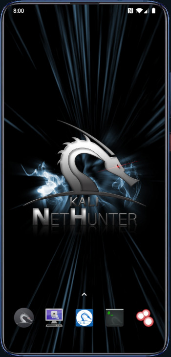
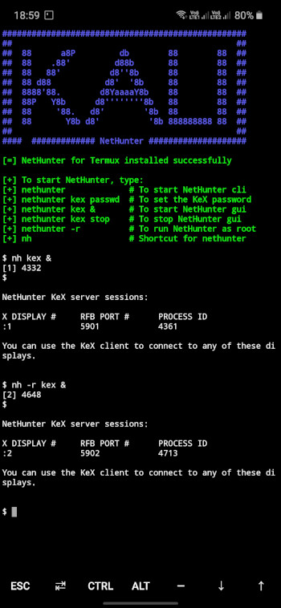
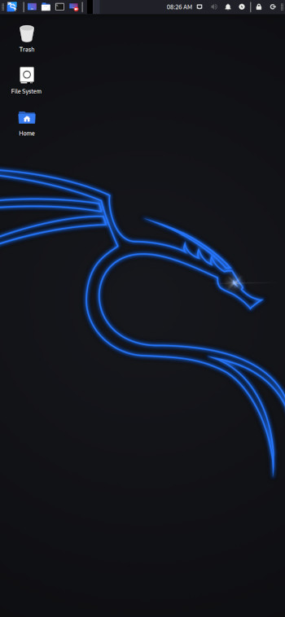
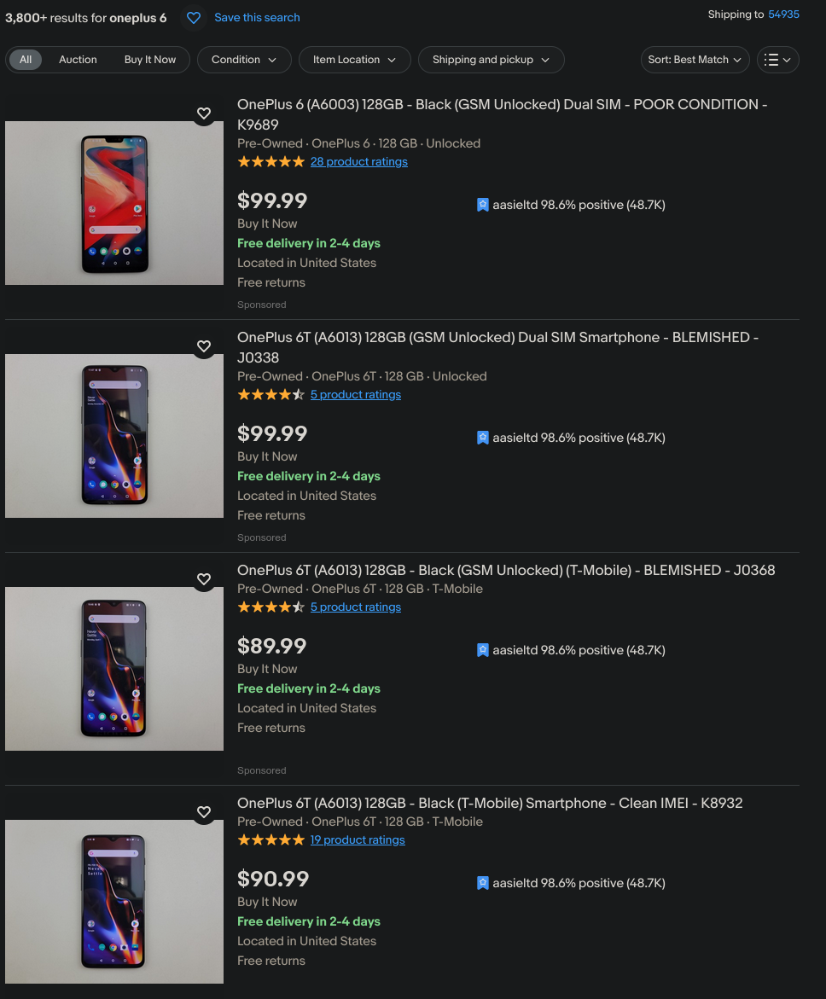
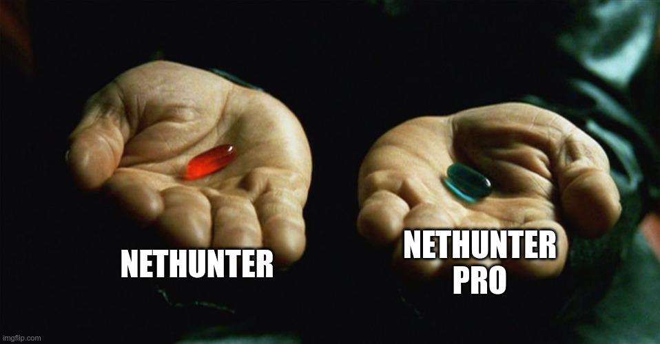
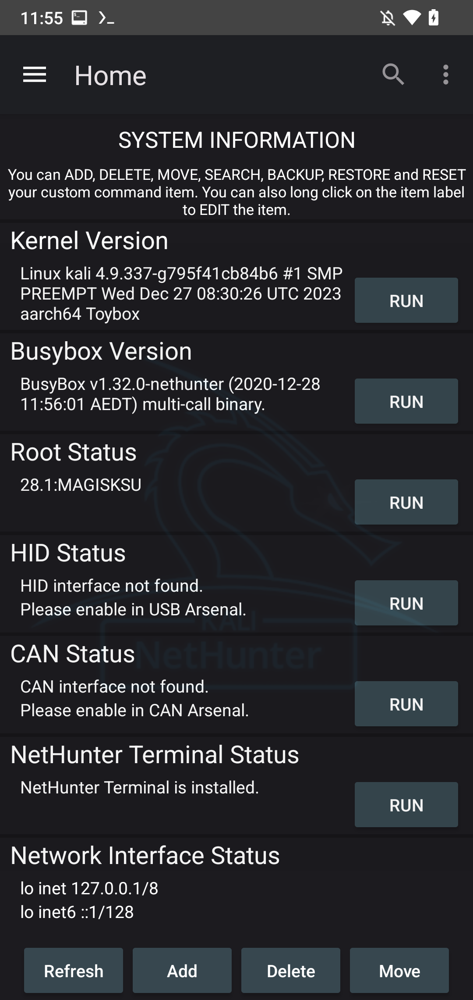
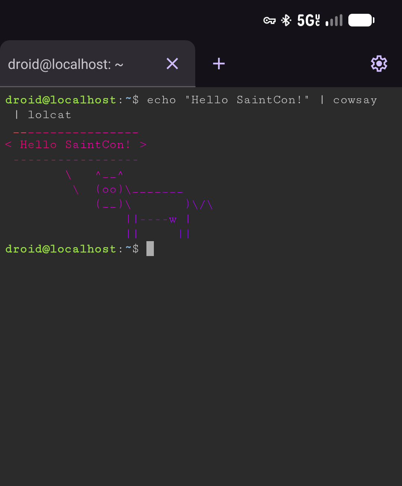

<style>

/* @theme rose-pine-moon */
/*
Rosé Pine theme create by RAINBOWFLESH
> www.rosepinetheme.com
MIT License https://github.com/rainbowflesh/Rose-Pine-For-Marp/blob/master/license

palette in :root
*/

@import "default";
@import "schema";
@import "structure";

:root {
    --base: #232136;
    --surface: #2a273f;
    --overlay: #393552;
    --muted: #6e6a86;
    --subtle: #908caa;
    --text: #e0def4;
    --love: #eb6f92;
    --gold: #f6c177;
    --rose: #ea9a97;
    --pine: #3e8fb0;
    --foam: #9ccfd8;
    --iris: #c4a7e7;
    --highlight-low: #2a283e;
    --highlight-muted: #44415a;
    --highlight-high: #56526e;

    font-family: Pier Sans, ui-sans-serif, system-ui, -apple-system,
        BlinkMacSystemFont, Segoe UI, Roboto, Helvetica Neue, Arial, Noto Sans,
        sans-serif, "Apple Color Emoji", "Segoe UI Emoji", Segoe UI Symbol,
        "Noto Color Emoji";
    font-weight: initial;

    background-color: var(--base);
}
/* Common style */
h1 {
    color: var(--rose);
    padding-bottom: 2mm;
    margin-bottom: 12mm;
}
h2 {
    color: var(--gold);
}
h3 {
    color: var(--love);
}
h4 {
    color: var(--rose);
}
h5 {
    color: var(--rose);
}
h6 {
    color: var(--rose);
}
a {
    color: var(--iris);
}
p {
    font-size: 20pt;
    font-weight: 600;
    color: var(--text);
}
code {
    color: var(--text);
    background-color: var(--highlight-muted);
}
text {
    color: var(--text);
}
ul {
    color: var(--subtle);
}
li {
    color: var(--subtle);
}
img {
    background-color: var(--highlight-low);
}
strong {
    color: var(--text);
    font-weight: inherit;
    font-weight: 800;
}
mjx-container {
    color: var(--text);
}
marp-pre {
    background-color: var(--overlay);
    border-color: var(--highlight-high);
}
.video {
    display: flex;
    justify-content: center;
    align-items: center;
}

/* Code block */
.hljs-comment {
    color: var(--muted);
}
.hljs-attr {
    color: var(--foam);
}
.hljs-punctuation {
    color: var(--subtle);
}
.hljs-string {
    color: var(--gold);
}
.hljs-title {
    color: var(--foam);
}
.hljs-keyword {
    color: var(--pine);
}
.hljs-variable {
    color: var(--text);
}
.hljs-literal {
    color: var(--rose);
}
.hljs-type {
    color: var(--love);
}
.hljs-number {
    color: var(--gold);
}
.hljs-built_in {
    color: var(--love);
}
.hljs-params {
    color: var(--iris);
}
.hljs-symbol {
    color: var(--foam);
}
.hljs-meta {
    color: var(--subtle);
}

</style>

# Mobile Pentesting with Kali Nethunter
## Saintcon 2025

### Brayden Houston
<!-- paginate: skip -->

<!--
Welcome

I know I am the last thing standing between you and lunch so thanks for being here! 


Johns comment about the garage sale. Here is what I found and dusted off to share
-->

---
<!-- paginate: true -->

```zsh
$ whoami
Name: Brayden Houston / 8BitFish
Job: Cybersecurity Engineer
Interests: homelab, automation, running
Groups: DC608, Wisconsin Cyber Response Team
Extra Notes: Thoughts are my own not my employeers
$ 
```

<!-- 
I am a recovering Software Engineer and decided to pivot to Cyber 

Wisconsin based state run volunteer task force that SLTTs (State Local Tribes and Territories). We respond to ransomware, phishing, and more around Wisconsin. 

-->

---
## Don't be evil
<!-- paginate: true -->


<!-- 
This platform is a tool. Don't misuse it. Don't be evil.
-->

---
## What is Kali?
<!-- paginate: true -->

<!--
Has anyone not heard of Kali?
-->

---
<!-- paginate: true -->



<!--
I think most of us are familiar with Kali - for those who aren't or for a quick review

Its the go to "hacking" distro. It packages a TON of tools out of the box:

John the Ripper
Wireshark
Burp Suite
Hydra
Metasploit
Its all here and we can always install more if it isn't
-->

---
## What is Kali Nethunter?
<!-- paginate: true -->


<!-- 

Its a great distro full of plenty of hacking tools ready to use

Nethunter takes those tools and its basically.....
-->

---
<!-- paginate: true -->
### Its Kali but on your phone


<!-- 

-->

---





---
## Why Nethunter?
<!-- paginate: true -->

- Turn you phone into a sick cyberdeck(phone?)
- Plug in usb devices for more options (SDR, more Wifi, etc)
- Phones are everywhere and who would expect a phone to be a security risk-it looks nothing like a Raspberry Pi or Flipper Zero 🐬

<!-- 
Older flagships still have a ton of power for a portable device. 
Built in wifi and BLE mean we don't need extra adapters or dongles to start scanning. 
Although most devices let you add those via usb too once rooted
-->


---

<!-- paginate: true -->
## Need More Reasons?

- Bad USB
- Wigle/Kismet Wardriving
- BT Attacks
- Wifi Scans, Deauth
- CAN Arsenal - Car Hacking
- It's your hardware-run what you want!


<!-- 
If you like a tool in Kali you probably have it here. If not install it or port it to have everything you want in your pocket.

Its a computer in your pocket - the sky is the limit


Just like John mentioned this morning Android is getting locked down. If we don't have tools to test with how can we find vulns.

-->

---

<!-- paginate: true -->
## What do we need to get started?

- One or more supported devices: tablet, phone, or watch (Sorry iOS 🥲)
- A few minutes or maybe an afternoon
- Decide which edition you want to try

<!-- 
Depending on what edition of nethunter you want to setup you might need some time to flash you device and run through some setup.

 Sorry this doesn't work on Apple devices
-->

---

<!-- paginate: true -->
## Where could we get a device?


- Ebay
- Facebook Marketplace
- local classifieds
- probably in that desk drawer back at home



<!-- 
Give that phone in your desk drawer a new life
-->

---
## Phone Options
<!-- paginate: true -->
Nethunter "Pro" - Run Nethunter Solo
	- Pinephone and ~~PinePhone Pro~~
	- Some Android Phones

Nethunter - Run Nethunter alongside Android
	- Most Android Phones



<!-- 
Depending on what device you choose to run Nethunter on your experience might be a little different.

Nethunter Pro runs a full standalone Linux Environment

"Regular" runs in alongside Android in a chroot. If you are rooted you have full access to both systems. 
-->

---
## Install Nethunter
<!-- paginate: true -->

https://www.kali.org/get-kali/#kali-mobile

<!-- 

In the interest of time I am not going over how to flash and root your device. Head to Kali and follow their docs. Youtube is also full of guides if you need more detailed instructions.

Model specific and generic images available so don't worry if your phone isn't listed.

-->

---
<!-- paginate: true -->
## Editions

| Edition            | Usage                                                                 |
| ------------------ | --------------------------------------------------------------------- |
| NetHunter Lite     | The full NetHunter package for rooted phones without a custom kernel. |
| NetHunter          | The full NetHunter package with custom kernel for supported devices   |

<!--
We have a device, now pick a version
-->

---
<!-- paginate: true -->

| Feature            | NetHunter Lite | NetHunter |
| ------------------ | -------------- | --------- |
| App Store          | Yes            | Yes       |
| Kali cli           | Yes            | Yes       |
| All Kali packages  | Yes            | Yes       |
| KeX                | Yes            | Yes       |
| Metasploit w/o DB  | Yes            | Yes       |
| Metasploit with DB | Yes            | Yes       |
| NetHunter App      | Yes            | Yes       |
| Requires TWRP      | Yes            | Yes       |
| Requires Root      | Yes            | Yes       |


---

## Couple Differences
<!-- paginate: true -->

| Feature        | NetHunter Lite | NetHunter |
| -------------- | -------------- | --------- |
| WiFi Injection | No             | Yes       |
| HID attacks    | No             | Yes       |
| BT Arsenal     | No             | Yes       |
| CAN Arsenal    | No             | Yes       |


<!-- 
Some stuff takes kernel level access to do.
-->

---

<!-- paginate: true -->
Probably not daily driver phone material


<!-- 
Understand the risks if you are going to rock a rooted phone as your daily. 

Rooting does give you access to lots of fun system resources but carries risk.

As something in your tool bag though.....

-->

---

## Pinephone Tour

<!--
When originally planning this talk I decided to grab a Pinephone for the "Pro" experience.

Lets take a quick look.....
-->

---

<!-- paginate: true -->
<section class="video">
<video src="./imgs/pinephone-edit.mp4" controls width="300"></video>
</section>

---

## PinePhone Impressions
<!-- paginate: true -->

Kinda like having a Raspberry Pi in your pocket-for better or worse.

The functionality is all there but the Posh Mobile interface isn't my favorite

The beta/developer hardware probably isn't doing the vision for the experience justice

Shout outs to the Pine64 IRC/Discord!

Pine64 has said they are discontinuing the Pinephone Pro - "standard" is still being sold

<!--

I figured I had to try the "Pro" 

- Still a dev kit level product-obviously not meant to be a flagship killer.

- Full access to the hardware without fighting vendor security is really nice
- I wanted to try it thinking life outside Android would be better, in my testing I think I would stick with NH on Android for now.....
- There are some stronger Linux phones on the horizon-I would sooner try those
-->


---

## Android Impressions
<!-- paginate: true -->

Still rocking a OnePlus6 as my Nethunter device

One of the Nethunter "Pro" compatible devices

Root access lets us re-purpose phone hardware (ex. OnePlus alert slider)

Android apps are nice to have. Sideload Gapps if you need them.



<!--
 Since we are rooted we have hardware access.
 
Alert slide could be used like a bash bunny slider. Run scripts or payload based on its position


Given the choice between the two options with hardware and shipping limitations, I think I would grab an Android phone for now...

-->

---
## Enough Slides. Do a demo already...


<!--
Lets try some DuckyScript
-->

---
## Is Rootless An Option?
<!-- paginate: true -->

---

## Yes, but....
<!-- paginate: true -->

| NetHunter Rootless | The core of NetHunter for unrooted, unmodified devices                |
| ------------------ | --------------------------------------------------------------------- |

| Feature            | NetHunter Rootless |
| ------------------ | ------------------ |
| App Store          | Yes                |
| Kali cli           | Yes                |
| All Kali packages  | Yes                |
| KeX                | Yes                |
| Metasploit w/o DB  | Yes                |

<!-- 
Low commitment and easy way to try out Kali Nethunter today. Just missing some of the bells and whistles we mentioned before.

If you are willing to take some trade offs its still a useful tool to keep in your....back pocket


Depending on your phone, one more option could also be.....
-->

---

## New Android Terminal

- Select Pixel or Samsung Android 16 devices - more soon?
- Full Debian VM
- Still some (Android) system and hardware restrictions
- It runs Doom (and other GUI apps)



<!--
Not Kali yet but this just dropped a couple weeks ago so I had to try it out. Since we have been looking at running extra systems on our phones....

Only has file access to the Downloads folder

VM images have to be signed by a CA. GrapheneOS has talked about building and signing their own. Maybe this could build out like WSL?

See https://source.android.com/docs/core/virtualization for more info
-->


---

## Ideas Next Steps

-  Mobile drop phone C2 node
-  "Off grid" file share or webserver
-  Bluetooth Payloads
-  CANBUS - This is pretty new to Nethunter
- Upcycle some phones and have some fun

---

## Q & A
<!-- paginate: true -->

---

## Slides
<!-- paginate: true -->
Reach out and show me what you do with Nethunter!

Slides are here:
https://github.com/braydenhouston/CC-KaliNethunter/tree/saintcon-2025


---

## Helpful Resources
<!-- paginate: true -->
https://forums.kali.org/
Pine64 - Discord and IRC channels
https://pine64.org/2025/08/14/august_2025_short_update/
@davidbombale
https://justhack.in/connect-to-kali-nethunter-vnc-server-from-local-network

Android Virtualization Framework Docs
https://source.android.com/docs/core/virtualization

Android Terminal Doom
https://www.androidauthority.com/android-16-linux-terminal-doom-3521804/